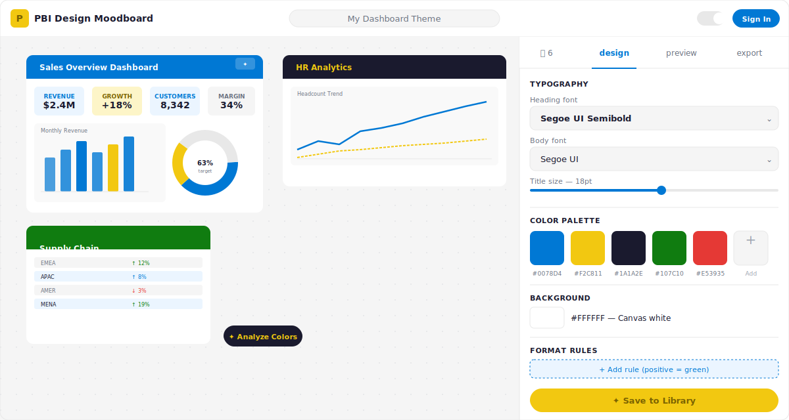

<div align="center">

# PBI Design Moodboard

**Build beautiful Power BI themes from dashboard screenshots. No sign-up required.**

Drop → Extract → Design → Export

</div>

---

## What is this?

PBI Design Moodboard is a tool for Power BI designers and developers to build a cohesive design system from their existing dashboards. Drop in screenshots, extract color palettes, configure typography, preview how it looks, and export ready-to-use theme files — all in the browser, with no backend required.



## Features

- **Moodboard canvas** — Drag, drop, resize, and paste Power BI screenshots onto an infinite canvas
- **Color extraction** — Click any screenshot to extract its palette using k-means clustering
- **Live preview** — See a mini Power BI dashboard mockup update in real time with your design system
- **Typography control** — Set heading/body fonts with PBI-compatible options (Segoe UI, DIN, etc.)
- **3 export formats** — PBI Theme JSON, Format Specification (Markdown), PBIP Visual Config
- **Works offline** — Everything autosaves to localStorage
- **Firebase sync** — Sign in to save and sync your moodboard library across devices

## Quick Start

```bash
npm install
npm run dev
```

Open [http://localhost:5173](http://localhost:5173) and start dropping screenshots.

## How to use

1. **Drop screenshots** onto the canvas — drag from your file system, paste from clipboard, or click to browse
2. **Click a screenshot** → hit **✦ Analyze Colors** to extract its palette
3. Go to the **Design** tab to set fonts, background color, and conditional formatting rules
4. Check the **Preview** tab to see a live Power BI dashboard mockup
5. Head to **Export** to download your theme as JSON, Markdown spec, or PBIP config

## Firebase Setup (optional — for cloud sync)

1. Create a project at [Firebase Console](https://console.firebase.google.com/)
2. Enable **Authentication** → Sign-in methods → Google + Email/Password
3. Create a **Firestore Database** (production mode)
4. Enable **Storage**
5. Copy your config to `.env`:

```bash
cp .env.example .env
# Fill in your Firebase config values
```

6. Deploy Firestore/Storage rules:

```bash
npx firebase-tools deploy --only firestore:rules,storage
```

7. Deploy to Firebase Hosting:

```bash
npm run build
npx firebase-tools deploy --only hosting
```

## Tech Stack

- React 19 + Vite
- Tailwind CSS v4
- Framer Motion
- Firebase (Auth, Firestore, Storage, Hosting)
- Pure canvas color extraction (no heavy dependencies)

## Architecture

```
src/
├── App.jsx              # Main app state & layout
├── firebase.js          # Firebase config & operations
├── hooks/
│   └── useTheme.js      # Dark/light mode hook
├── lib/
│   ├── colorExtractor.js  # k-means color extraction
│   ├── themeExporter.js   # PBI theme/spec/PBIP export
│   └── storage.js         # localStorage persistence
└── components/
    ├── Header.jsx         # Top bar with theme name + auth
    ├── MoodboardCanvas.jsx# Infinite drag/drop canvas
    ├── DropZone.jsx       # Drag/drop/paste upload
    ├── ImageCard.jsx      # Resizable screenshot card
    ├── ColorPalette.jsx   # Extracted colors with copy/remove
    ├── DesignPanel.jsx    # Typography + background + rules
    ├── LivePreview.jsx    # Mini PBI dashboard mockup
    ├── ExportPanel.jsx    # Download/copy all export formats
    └── AuthModal.jsx      # Firebase auth (Google + Email)
```

## Firestore Structure

```
users/
  {userId}/
    moodboards/
      {moodboardId}/
        name, colors[], fonts{}, background, formatRules[], createdAt, updatedAt
```
